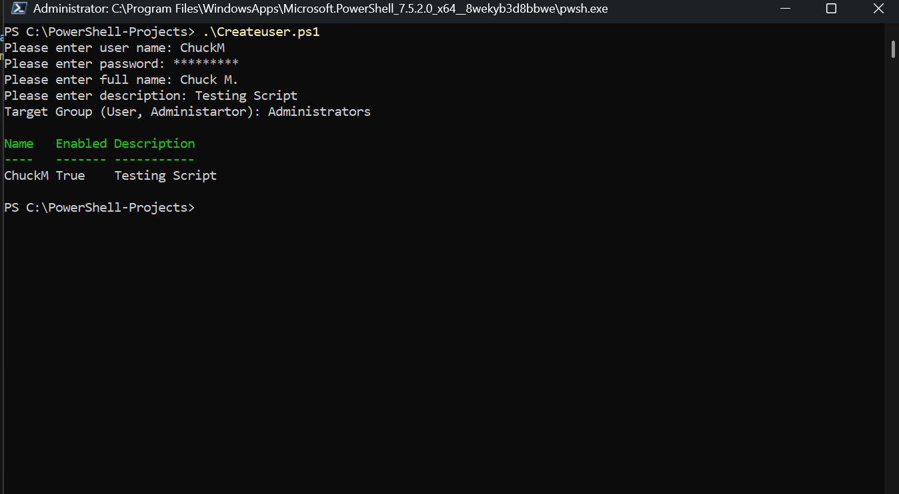

# PowerShell Projects Portfolio

This repository contains a collection of PowerShell scripts I’ve written to automate tasks, streamline IT operations, and demonstrate my scripting knowledge.  
Each project highlights different aspects of PowerShell, from Active Directory automation to file management and system monitoring.

## 🛠 Skills Demonstrated (Inprogress)
- Creating folders for website and generating a empty index.html file.

## 📂 Project Structure
Each folder contains:
- **website_foldercreator.ps1** → Creating Website Project Folder.
- **README.md** → A short description of what the script does, how to use it, and any requirements
- **Example Output** (if applicable) → Sample logs, reports, or screenshots

# Creating Local User Group 09/10/2025
# Createuser.ps1
- Script creates a local user account and ask for user name, password, description and the group the user will be in. Results of running the script in image below.

# Ouptput a text file from looking a folder items 09/10/2025
- Scripts ask for the source folder then gets the folder's child items then Outputs the results in a file in the destniation folder and file entered by the user.

- Sample file name is called ProjectFiles.txt

